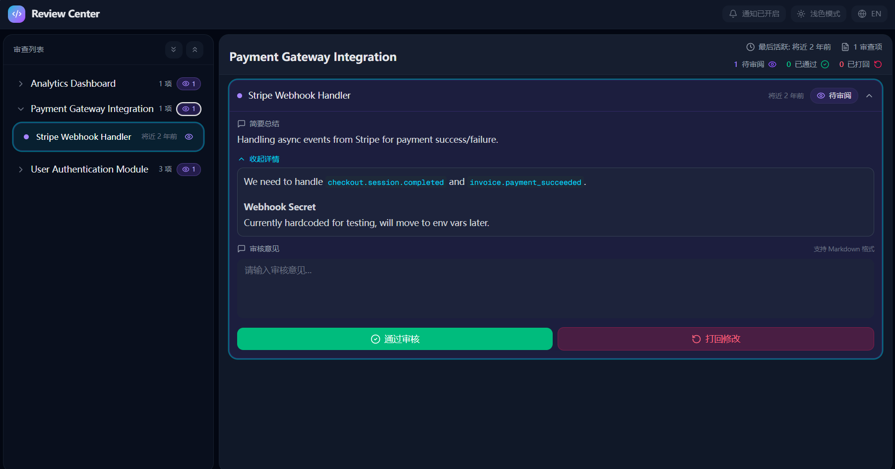
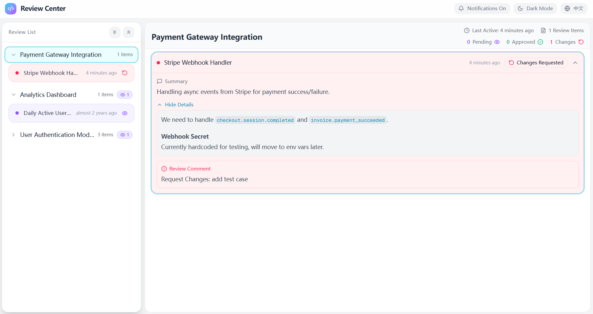

# Copilot Review Hub

[English](#english) | [简体中文](#简体中文)

---

<a id="english"></a>
## English

**Copilot Review Hub** is a powerful Model Context Protocol (MCP) server designed to introduce a "Human-in-the-Loop" workflow for AI coding agents (like GitHub Copilot). It provides a web-based dashboard where human experts can review, approve, or request changes to the code or plans generated by AI agents before they proceed.

### 🌟 Why use Copilot Review Hub?

- **💰 Save Copilot Quota**: Clarify requirements and context in a single, structured review session, reducing the need for back-and-forth chat turns.
- **🎯 Solve Problems Precisely**: Focus on solving specific issues effectively by verifying the plan before execution.
- **🤝 Human-in-the-Loop**: Ensure solutions are correct and aligned with your intent before Copilot generates code, avoiding wasted effort and incorrect directions.

### 🌟 Features

- **MCP Integration**: Exposes the `request_expert_review` tool, allowing AI agents to proactively request human review at critical milestones.
- **Blocking Review Workflow**: The AI agent pauses execution and waits until the human reviewer provides feedback.
- **🔔 System Notifications**: Get desktop notifications instantly when a new review request arrives.
- **🚀 Auto-Start & Conflict-Free**: The MCP server starts automatically with Copilot. It intelligently manages ports (default 3456) so multiple VS Code windows can share a single dashboard instance without conflict.
- **�� Centralized Session Management**: All review sessions from different Copilot chats are aggregated in one place for easy management.
- **Modern Web Dashboard**:
  - Built with **Next.js 16** and **Tailwind CSS**.
  - **Real-time Updates**: Reviews appear instantly.
  - **Dark/Light Mode**: Seamless theme switching.
  - **Internationalization**: Fully localized interface (English/Chinese).
- **Rich Context**: Supports Markdown rendering for review summaries and detailed descriptions.

### 📸 Dashboard Preview

*(The following data is generated for demonstration purposes)*

| Dark Mode | Light Mode |
| --- | --- |
|  |  |

**Interface Overview:**
- **Left Sidebar**: Groups review requests by "Task" (e.g., "User Authentication", "Payment Gateway").
  - 🟢 **Approved**: Tasks that have passed review.
  - 🔴 **Needs Revision**: Tasks that require AI adjustment.
  - 🟡 **Pending**: Tasks waiting for your input.
- **Main Area**: Displays the review details, including Markdown-rendered plans, code snippets, and questions.
- **Action Bar**: "Approve" or "Request Changes" with comments.

### 🛠 Prerequisites

Before you begin, ensure you have the following installed:

- **Node.js**: **v20.0.0** or higher (Required for Next.js 16 and React 19).
- **Package Manager**: npm (v9+), yarn, or pnpm.

### 🚀 Installation

1.  **Clone the repository**:
    ```bash
    git clone https://github.com/aoeiuvb/copilot-review-hub.git
    cd copilot-review-hub
    ```

2.  **Install dependencies**:
    ```bash
    npm install
    ```

### 🏃‍♂️ Running the Project

There are two modes to run this project:

#### 1. Development Mode (UI Only)
Use this for developing the frontend dashboard.
```bash
npm run dev
```
- Dashboard URL: [http://localhost:3000](http://localhost:3000)

#### 2. Production / Integrated Mode (MCP Server + UI)
**This is the mode required for GitHub Copilot integration.** It builds the project and starts the Express server that handles both MCP requests and the Web Dashboard.

1.  **Build the project**:
    ```bash
    npm run build
    ```
    *Note: You must rebuild whenever you change the source code.*

2.  **Start the server**:
    ```bash
    npm run start
    ```
- **Integrated Server URL**: [http://localhost:3456](http://localhost:3456)
- **MCP Transport**: Stdio (Standard Input/Output)

### 🔌 Configure GitHub Copilot (VS Code)

To let GitHub Copilot use this tool, you need to configure the MCP server in VS Code.

1.  Ensure you have built the project (`npm run build`).
2.  Create or edit the `.vscode/mcp.json` file in the **root** of your workspace.

**Configuration Example**:

```json
{
  "servers": {
    "copilot-review-hub": {
      "command": "node",
      "args": [
        "${workspaceFolder}/build/index.js"
      ],
      "env": {
        "NODE_ENV": "production"
      }
    }
  }
}
```

> **⚠️ Important Path Note**:
> - The path in `args` (`build/index.js`) must be correct.
> - Using `${workspaceFolder}` ensures VS Code resolves the path correctly regardless of where you open the project.
> - If you are not opening the project root directly, use an **absolute path** to the `build/index.js` file.

3.  **Restart MCP Server**:
    - Open the Command Palette (`Ctrl+Shift+P` / `Cmd+Shift+P`).
    - Run **"MCP: Restart Servers"** (or reload the window).
    - Verify it's running via **"MCP: List Servers"**.

### 💡 Usage Workflow

1.  **Start the MCP Server**: Ensure the server is configured and running in VS Code.
2.  **Chat with Copilot**: In Copilot Chat (Agent Mode), ask it to perform a complex task.
3.  **Trigger Review**: When Copilot reaches a critical step, it will call `request_expert_review`.
4.  **Review on Dashboard**:
    - 浏览器打开 [http://localhost:3456](http://localhost:3456)。
    - 您会看到一个状态为 "Pending" 的评审请求。
5.  **Provide Feedback**:
    - 点击 **"Approve" (通过)** 让 Copilot 继续执行。
    - 点击 **"Request Changes" (请求修改)** 并输入建议，让 Copilot 修正问题并重试。

---

<a id="简体中文"></a>
## 简体中文

**Copilot Review Hub** 是一个强大的 Model Context Protocol (MCP) 服务器，旨在为 AI 编程智能体（如 GitHub Copilot）引入“人机协同（Human-in-the-Loop）”工作流。它提供了一个基于 Web 的仪表盘，允许人类专家在 AI 智能体继续执行之前，审查、批准或要求修改其生成的代码或计划。

### �� 为什么选择 Copilot Review Hub？

- **💰 节省 Copilot 次数**：通过一次性清晰、结构化的需求描述与确认，大幅减少与 AI 的反复对话轮次。
- **🎯 精准解决问题**：在执行前验证方案，确保 AI 专注于解决特定的单个问题，避免跑偏。
- **🤝 人机协同**：在生成代码前介入，确保方向正确，避免生成无效代码浪费配额与时间。

### 🌟 功能特性

- **MCP 集成**：向 AI 智能体暴露 `request_expert_review` 工具，允许其在关键节点主动请求人工评审。
- **阻塞式评审流**：AI 智能体在发起评审后会暂停执行，直到收到人类评审员的反馈。
- **🔔 系统通知**：当有新的评审请求到达时，即时接收桌面通知。
- **🚀 自动启动与无冲突**：MCP 服务随 Copilot 自动启动。智能端口管理（默认 3456）确保多个 VS Code 窗口可以共享同一个仪表盘实例，不会发生端口冲突。
- **�� 集中会话管理**：来自不同 Copilot 对话的所有评审会话都会聚合在一个地方，便于统一管理。
- **现代化 Web 仪表盘**：
  - 基于 **Next.js 16** 和 **Tailwind CSS** 构建。
  - **实时更新**：评审请求即时显示。
  - **深色/浅色模式**：无缝切换主题。
  - **国际化支持**：完整的中英文界面支持。
- **丰富的内容展示**：支持 Markdown 渲染，清晰展示评审摘要和详细描述。

### 📸 仪表盘预览

*(下图展示了生成的测试数据效果)*

| 深色模式 | 浅色模式 |
| --- | --- |
|  |  |

**界面概览：**
- **左侧边栏**：按“任务”分组显示评审请求（例如“用户认证模块”、“支付网关”）。
  - 🟢 **Approved (已通过)**：已完成并通过评审的任务。
  - 🔴 **Needs Revision (需修改)**：需要 AI 进行调整的任务。
  - 🟡 **Pending (待评审)**：等待您处理的任务。
- **主区域**：显示详细的评审内容，支持 Markdown 渲染的计划、代码片段和问题。
- **操作栏**：提供“Approve (通过)”或“Request Changes (请求修改)”按钮。

### 🛠 前置要求

在开始之前，请确保您的环境满足以下要求：

- **Node.js**：**v20.0.0** 或更高版本（Next.js 16 和 React 19 的要求）。
- **包管理器**：npm (v9+), yarn, 或 pnpm。

### 🚀 安装指南

1.  **克隆仓库**：
    ```bash
    git clone https://github.com/aoeiuvb/copilot-review-hub.git
    cd copilot-review-hub
    ```

2.  **安装依赖**：
    ```bash
    npm install
    ```

### 🏃‍♂️ 运行项目

本项目支持两种运行模式：

#### 1. 开发模式 (仅 UI)
用于开发前端仪表盘界面。
```bash
npm run dev
```
- 仪表盘地址：[http://localhost:3000](http://localhost:3000)

#### 2. 生产 / 集成模式 (MCP Server + UI)
**这是与 GitHub Copilot 集成所需的模式。** 它会构建项目并启动 Express 服务器，同时处理 MCP 请求和 Web 仪表盘。

1.  **构建项目**：
    ```bash
    npm run build
    ```
    *注意：每次修改源码后都需要重新构建。*

2.  **启动服务器**：
    ```bash
    npm run start
    ```
- **集成服务器地址**：[http://localhost:3456](http://localhost:3456)
- **MCP 传输协议**：Stdio (标准输入/输出)

### 🔌 配置 GitHub Copilot (VS Code)

要让 GitHub Copilot 使用此工具，您需要在 VS Code 中配置 MCP 服务器。

1.  确保您已构建项目 (`npm run build`)。
2.  在工作区**根目录**创建或编辑 `.vscode/mcp.json` 文件。

**配置示例**：

```json
{
  "servers": {
    "copilot-review-hub": {
      "command": "node",
      "args": [
        "${workspaceFolder}/build/index.js"
      ],
      "env": {
        "NODE_ENV": "production"
      }
    }
  }
}
```

> **⚠️ 路径配置重要提示**：
> - `args` 中的路径 (`build/index.js`) 必须准确。
> - 使用 `${workspaceFolder}` 可以确保 VS Code 无论在哪里打开项目都能正确解析路径。
> - 如果您不是直接打开的项目根目录，建议使用 `build/index.js` 文件的**绝对路径**。

3.  **重启 MCP 服务器**：
    - 打开命令面板 (`Ctrl+Shift+P` / `Cmd+Shift+P`).
    - Run **"MCP: Restart Servers"** (or reload the window).
    - Verify it's running via **"MCP: List Servers"**.

### 💡 使用流程

1.  **启动 MCP 服务**：确保 VS Code 已加载配置并启动了 MCP 服务器。
2.  **与 Copilot 对话**：在 Copilot Chat (Agent 模式) 中，要求它执行一个复杂任务。
3.  **触发评审**：当 Copilot 遇到关键步骤时，它会自动调用 `request_expert_review`.
4.  **在仪表盘评审**：
    - 浏览器打开 [http://localhost:3456](http://localhost:3456)。
    - 您会看到一个状态为 "Pending" 的评审请求。
5.  **提供反馈**：
    - 点击 **"Approve" (通过)** 让 Copilot 继续执行。
    - 点击 **"Request Changes" (请求修改)** 并输入建议，让 Copilot 修正问题并重试。
